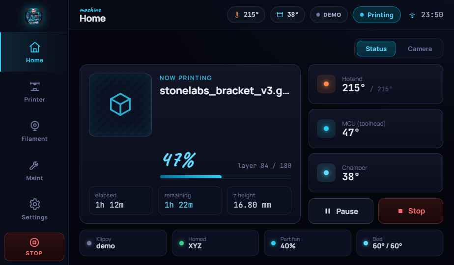
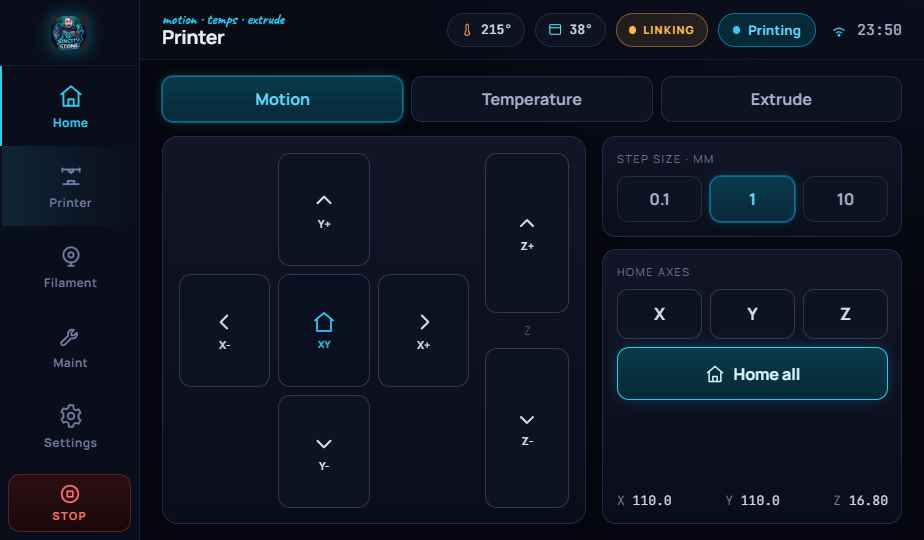
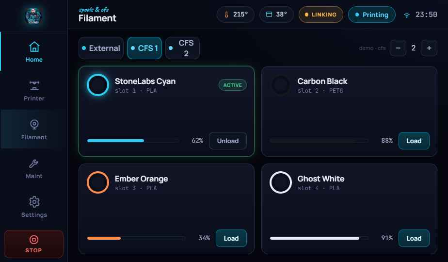
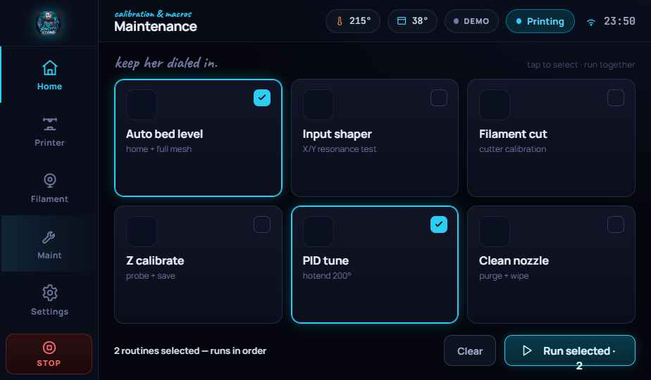

# StoneLabs Printer UI

A modern, touch-first control interface for **Klipper** 3D printers. Built for a
7″ 1024×600 panel, themed in the StoneLabs look (deep-ink canvas, electric-cyan
accent), and driven live by **Moonraker** over the LAN.

A standalone web app that **replaces KlipperScreen**. One **100% offline** HTML
file you run full-screen in a browser kiosk, talking to Moonraker over the LAN.

Designed for a custom Klipper printer with the **Creality CFS** multi-material
system (1–4 boxes, 4 slots each, auto-detected).



| Printer (motion) | Filament (CFS) | Maintenance |
|---|---|---|
|  |  |  |

---

## Highlights

- **Live & real.** Subscribes to Moonraker printer objects (temps, position,
  print state/progress, fans, `save_variables`) and sends real G-code / RPC for
  every control.
- **Five screens.** Home (status + camera), Printer (XYZ jog, temps, extrude),
  Filament (external + dynamic CFS tabs), Maintenance (selectable routines, run
  in batch), Settings (Moonraker connection, camera, system).
- **CFS-aware.** CFS tabs appear only for detected units; slot colors, fill, and
  the active slot come straight from your `save_variables`.
- **Toggleable camera** on Home (MJPEG stream with a temp/progress overlay).
- **100% offline.** React, the runtime, all fonts, and the logo are embedded in
  the single HTML file. The only network traffic is the **LAN** WebSocket to your
  printer. No internet at setup, first paint, or ever. Air-gap friendly.
- **Boots to kiosk.** A systemd service launches Chromium full-screen into the UI.

---

## Hardware this targets

- **Display:** 7″ 1024×600 IPS capacitive touchscreen (Raspberry Pi compatible).
- **Host:** Raspberry Pi 4/5 or NVIDIA Jetson running Klipper + Moonraker.
- **Multi-material:** Creality CFS (1–4 units × 4 slots) + an external spool.

> It works on any Klipper + Moonraker setup. The CFS pieces are optional and
> degrade gracefully if you don't have one.

---

## Quick start (web UI kiosk)

On the printer host (Pi/Jetson), from this repo:

```bash
cd web-ui/kiosk
chmod +x install.sh
./install.sh                       # installs Chromium, publishes the UI to Moonraker
sudo systemctl restart moonraker   # picks up the static-files entry
sudo systemctl start stonelabs-ui  # launches the kiosk (also boots on power)
```

Then on the panel: **Settings → Moonraker connection**, enter your printer's host,
**Connect**. Full walkthrough (kiosk service, Wayland variant, troubleshooting,
the offline guarantee) is in **[`docs/web-ui.md`](docs/web-ui.md)**.

Just want to look at it? Open **`web-ui/stonelabs-printer-ui.html`** in any
browser. It runs in DEMO mode with simulated data until it reaches a printer.

---

## Repository layout

```
.
├── README.md
├── docs/
│   └── web-ui.md                  # deploy + 100%-offline guide
├── web-ui/
│   ├── stonelabs-printer-ui.html  # ← the offline build (run this)
│   ├── cfs_macros.cfg             # Klipper-side: save_variables + CFS/maintenance macros
│   ├── kiosk/                     # systemd service + installer
│   │   ├── install.sh
│   │   ├── stonelabs-ui.service
│   │   ├── stonelabs-ui.default
│   │   └── README.md
│   └── src/                       # editable source
│       ├── stonelabs-printer-ui.dc.html
│       ├── build-deploy.dc.html   # build input for the offline bundle
│       ├── support.js
│       ├── fonts/
│       └── assets/
└── screenshots/
```

---

## Wiring it to your printer

The UI sends standard G-code for motion/temps/extrude, Moonraker RPC for
print/emergency control, and **your macros** for CFS and maintenance. The only
names you may need to match to your config:

- **CFS:** `CFS_LOAD UNIT=n SLOT=m` / `CFS_UNLOAD`, `CFS_LOAD_EXTERNAL` /
  `CFS_UNLOAD_EXTERNAL`, fed by `save_variables` (`cfs_units`, `cfs_active_unit`,
  `cfs_active_slot`, `cfs{u}_slot{s}_{name,material,color,remaining}`).
- **Maintenance:** `BED_MESH_CALIBRATE`, `SHAPER_CALIBRATE`,
  `FILAMENT_CUT_CALIBRATION`, `PROBE_CALIBRATE`, `PID_CALIBRATE`, `CLEAN_NOZZLE`.

All of these live in one `renderVals()` block in
`web-ui/src/stonelabs-printer-ui.dc.html` (search for the command string). See
`web-ui/cfs_macros.cfg` for ready-to-edit macros (CFS load/unload, external spool,
nozzle clean, Z-calibrate wrapper) + the CFS `save_variables` scheme and a
`CFS_DEMO_SEED` macro that populates the Filament screen with sample spools.

---

## Safety

This software commands a 3D printer (heaters, motion, an emergency stop). **Test
it carefully and supervise early prints.** It's provided as-is, with no warranty.
You are responsible for your machine.

## License

© SinCity Stone / StoneLabs. Released under the **PolyForm Noncommercial License
1.0.0**. Free to use, modify, and share for **any noncommercial purpose**
(personal, hobby, research, education, nonprofits). **Commercial use requires a
separate license**. Contact the author. Full terms in [`LICENSE`](LICENSE).

Bundled third-party components keep their own licenses: **React / ReactDOM** (MIT);
fonts **Manrope**, **JetBrains Mono**, **Caveat**, **Indie Flower** (SIL OFL 1.1).

Talks to (does not include or modify) [Klipper](https://www.klipper3d.org/) and
[Moonraker](https://github.com/Arksine/moonraker) over their network API.
